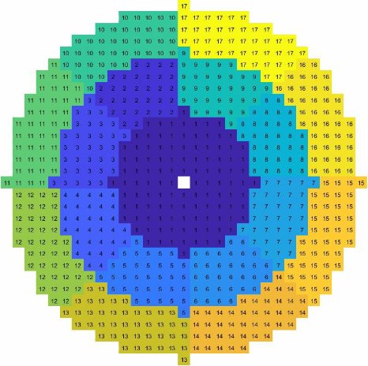

Explanatory video:         <https://youtu.be/TXnlSzujwks> 

**Problem formulation**

You have to write a custom classifier program that can classify human actions based on small (few frames) video sequences of a single person performing the action.

**Input:**  a set of videos (image-sequences) to be classified **Output:**  a label (classification result) for each input object

“walking” “boxing” “clapping”

   3

Tasks to do

Write an appropriate feature extractor (3D GLOH descriptor), extract the features from the training data, train a model and classify some test data.

**The feature extractor** receives an image sequence and returns a “good” feature vector that has small intra-class and large inter-class variance.

**The training phase** uses the aforementioned extractor on labelled data and trains a model (e.g. SVM) for a classification task.

**The trained classifier** processes unseen (test) data and gives a class label for each instance in this set.

Key results to be presented:

You may code freely, as there are not so many restrictions on what to use. However, you should create the followings as the result of your work:

**main script** which loads training data, trains the model and performs classification with test data

**feature extraction function** which is used to create 3D GLOH vectors from the input image sequence

**model parameters** of the trained classifier, and

additional **figures** and **text outputs** as described in the upcoming slides.

**Training & testing data**

The training (and test) data [1] has 3 classes: walking, clapping, boxing

Each training class has 10 short image sequences in a MAT file, stored as a 4D array. In this structure, the fourth index is the ID of the sequence (1-10), the third one is the frame index within the sequence (1-50), and the first two coordinates are the pixel locations (row, column) in a single frame.

Testing is done with a test data set containing 5 unlabelled sequences stored in the same way as for the training data.

Feature extractor function

This function has exactly one input argument. The extracted feature has to be the 3D GLOH descriptor at the three most significant points.

The 3D GLOH feature is described in articles [2] and [3], additional hints and specification can be found in the upcoming slides.

There is no code package for this assignment.

All scripts and functions must be written entirely by you.

Download the image to be processed from here:

<https://beta.dev.itk.ppke.hu/bipa/assignment_04> 

hints

You should create a script named a04\_NEPTUN\_train.m where the NEPTUN part is your Neptun ID. This has to be the first script; running that must be able to prepare the training data.

The created feature extractor function should be called extract\_feature This function must have a single input argument (an H×W×F matrix) where H and W are the frame height and width, and F is the number of frames in the sequence (50). The extracted feature must be the one described in [2]

The training of the classifier is done using a Matlab App. The trained classifier (model) must be saved as action\_classifier.mat

A second script file named a04\_NEPTUN\_test.m has to be created as well. This file should load the trained classifier from the .mat file, load the test data and do a prediction with the test data.

You are allowed to create other files (e.g. additional functions) too, if necessary. 

Please submit **ALL** files (including the input folder as well) in a **ZIP** file via the Moodle system. **Check the upcoming slides for hints!**

Hint 13

The 3D GLOH feature means a three-dimensional Gradient Location and Orientation Histogram, which is created at “interesting” points in space-time.

Each image sequence (video) is described by a single feature vector that is created from 5 concatenated 3D GLOH features.

First, “interesting points” should be detected on a single frame (e.g., use the 10th frame, or anything you wish) using the SIFT method. You may use the Matalb’s built-in detectSIFTFeatures function.

Next, the 5 strongest feature points has to be selected at which the 3D GLOH feature is to be extracted.

Hint 3

The feature is created from a “cylinder” in space-time. The cylinder is constructed from 9 disks, each having a diameter of 31 pixels. The selected feature point (the strong SIFT feature point) is in the middle of the cylinder.

The disks represent the same neighborhood in the neighboring frames.

(t – 4) -th frame the middle disk 

(neighborhood in frame *t*)

the center of the strong SIFT feature

(t + 4) -th frame 12

Hint 14 

The disks are divided into 17 regions. A pixels belongs to a region based on its polar coordinates: 

The regions are where the radius is  0 < r ≤ 6   and  6 < r ≤ 11  and  11 < r 

Every region but the center one is further divided into 8 parts based on the angle.

Hint 15

In each region of the consecutive disks, the 3D gradients are calculated as described in [3]. For each cropped region, compute the 3D magnitude and the two angle values as 

where the L values are computed using finite difference approximations, for example      is approximated by 

Hint 6

For each region the orientation histogram has to be calculated. This is done in a similar way that is used in the HOG method. 

The two angles define a vector in the sphere: 

For orientation binning, this sphere is divided into nine parts, where the theta and phi angles are in the [-90°, -30), [-30°, 30°), [30°, 90) regions:

`  `90° 

For each vector, find the corresponding bin   30° and add the magnitude value to the bin.

θ

- 30°

Φ

- 90° − 30°  30°  90° 15

Hint 20

The spatio-temporal feature vector is the linearized version of the 17 × 9 3D orientation gradients. It is wise to perform block-normalization on the individual regions of the cylinder.

In this application, normalization means that the sum of the bins in a 9-bin histogram must be equal to one, thus the sum of the whole feature vector is 17.0

The image sequence is described by the 5 strongest feature points. Hence the descriptor of the sequence is a single row vector containing 5 × 17 × 9 numbers.

Ordering of the features based on spatial data seems to be a smart idea!

Training a classifier should be done by the **Classification Learner** MATLAB application. This is part of the *Statistics and Machine Learning Toolbox* which you may have to download (using the License you got from PPCU).

Prepare the data for training as described in the support article: [https://www.mathworks.com/help/stats/select-data-and-validation-for-classifi cation-problem.html](https://www.mathworks.com/help/stats/select-data-and-validation-for-classification-problem.html) 

Chose a model type that is best for the task based on your opinion. Tune the model parameters if necessary.

When everything is ready, start the training using the green “play” button.

When the training is finished, use the Export Model button to save the trained classifier. (Do not use the Export Compact Model; the training data should be included in the saved object.) 

Name the model as action\_classifier 

Save the variable as a .mat file. Right click the variable in the workspace and use the Save As… option in the context menu.

In the second script (a04\_NEPTUN\_test.m) you have to load the test data as well as the trained model.

Use the trained model to predict the actions performed in the test image sequences.

The result of the script has to be a console output showing the predicted label:

**References**

1. Schuldt, Laptev and Caputo, *Proc. ICPR'04, Cambridge, UK* (2005)* https://www.csc.kth.se/cvap/actions/
1. Abdulmunem, Ashwan & Lai, Yu-Kun & Sun, Xianfang. (2016). 3D GLOH features for human action recognition. DOI: 10.1109/ICPR.2016.7899734 
1. Paul Scovanner, Saad Ali, and Mubarak Shah. 2007. A 3-dimensional sift descriptor and its application to action recognition. In Proceedings of the 15th ACM international conference on Multimedia (MM '07). Association for Computing Machinery, New York, NY, USA, 357–360. DOI: 10.1145/1291233.1291311

**THE END**
26
